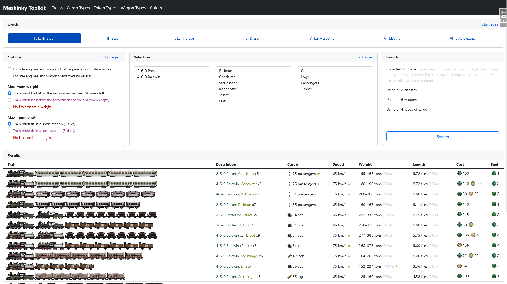

# mashinky-calculator

Calculate optimal trains for Mashinky.



## Usage

Create a .env file containing configuration:

```env
MASHINKY_GAME_DATA="/mnt/d/Program Files/SteamLibrary/steamapps/common/Mashinky/"
FLASK_DEBUG=1
```
Install dependencies:

```shell
poetry install
```

Build the database:

```shell
poetry run python -m mashinky.extract
```

Run the server:

```shell
poetry run flask run
```
